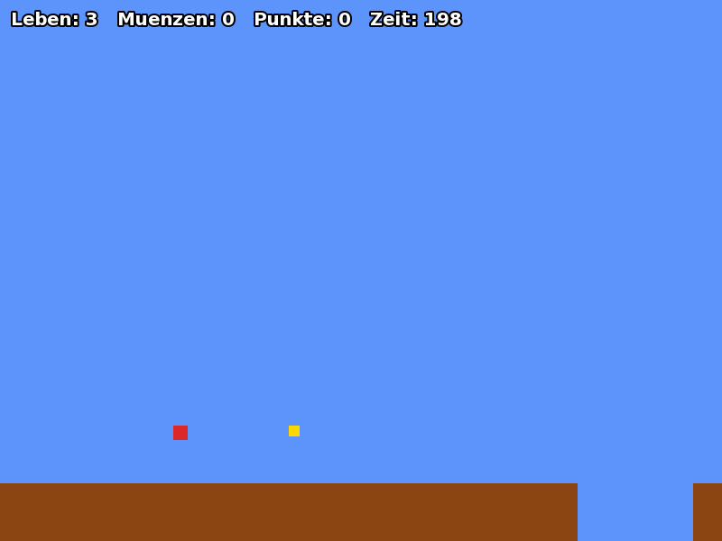
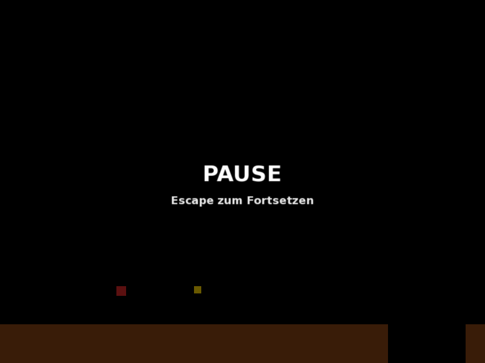

# Screenshots

Aktueller Entwicklungsstand des Projekts (Etappe 6). Wichtig: Es gibt noch
**keine echten Sprites** — Player, Gegner und Items sind bewusst als farbige
Platzhalter-Formen gerendert (siehe Abschnitt *"Bekannter Stand"* in der
[README](../README.md)). Die Screenshots zeigen also die **Funktionalität**
(Physik, HUD, State Machine), nicht die finale Optik.

## Gameplay mit HUD

Spieler (rotes Quadrat) läuft durchs Level, ein Goomba (braun) patrouilliert,
ein Item (gelb) schwebt. Oben links das On-Screen-HUD: Leben, Münzen, Punkte,
verbleibende Zeit — in Etappe 6 eingebaut, ersetzt den früheren
Fenstertitel-Notbehelf.

## Spielstart

Direkt nach dem Wechsel vom Menü in den `PlayingState`: Spieler-Spawnpunkt,
Boden mit der eingebauten Lücke (zum Testen der Fallphysik), erste Gegner und
Items sichtbar am Horizont.

## Pause-Screen

`PausedState` friert die komplette Spielwelt ein (kein Update für
Player/Enemies/Timer) und legt ein abgedunkeltes Overlay mit zentriertem
HUD-Text darüber — Escape zum Fortsetzen.

---

*Alle Screenshots wurden während automatisierter Tests aufgenommen (Xvfb +
simulierter Tastatur-Input), nicht von Hand — daher die eher "zufällige"
Spielerposition auf den Bildern.*
